# 📸 Zero Trust Network – Experiment Screenshots

## 🔹 1. Network Topology

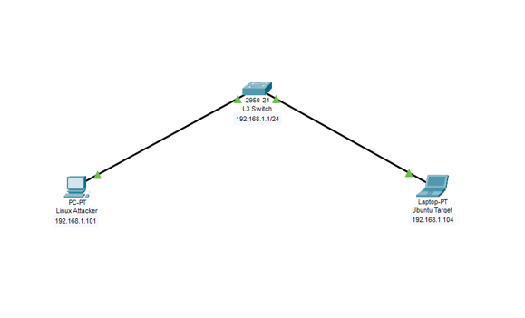
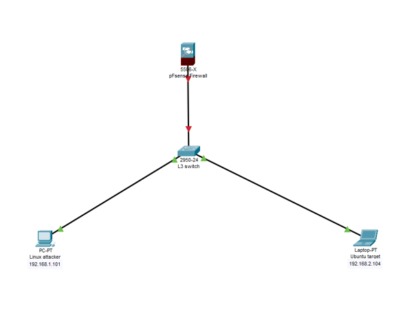

---

## 🔹 2. Initial Configuration

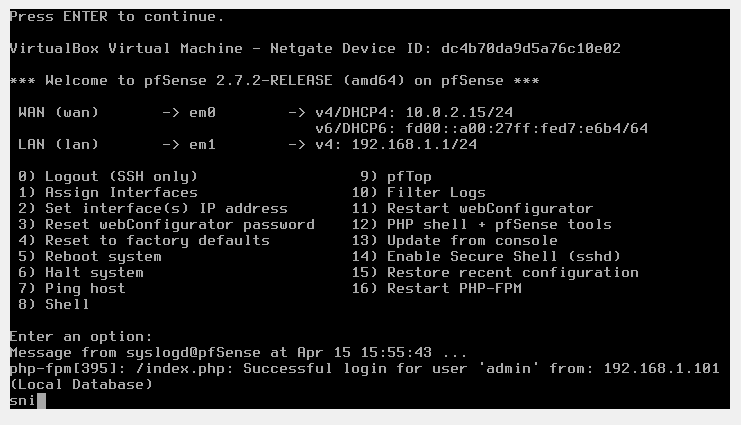
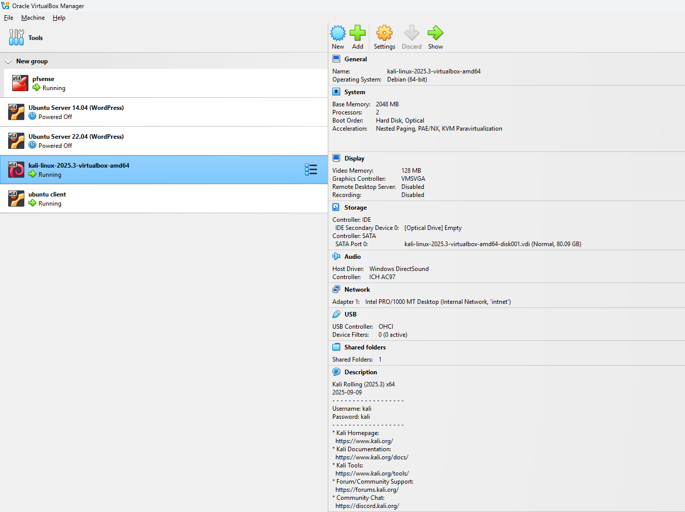
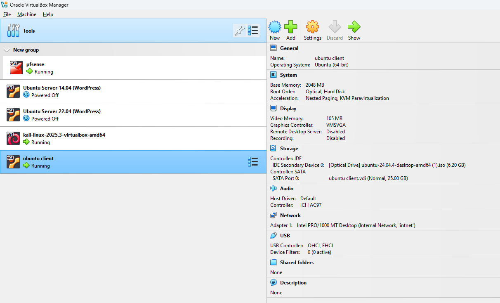

---

## 🔹 3. Firewall Rules

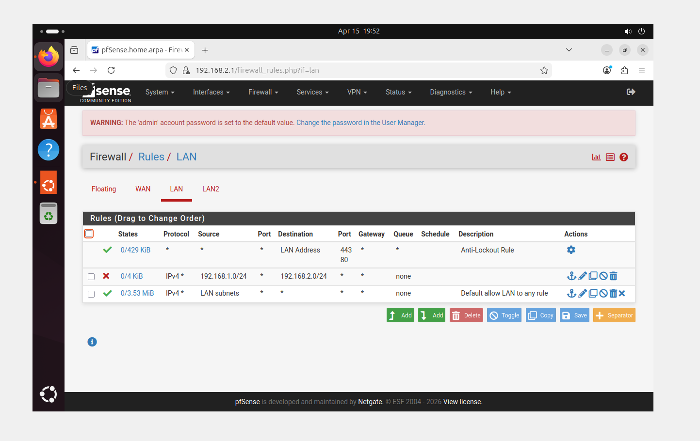
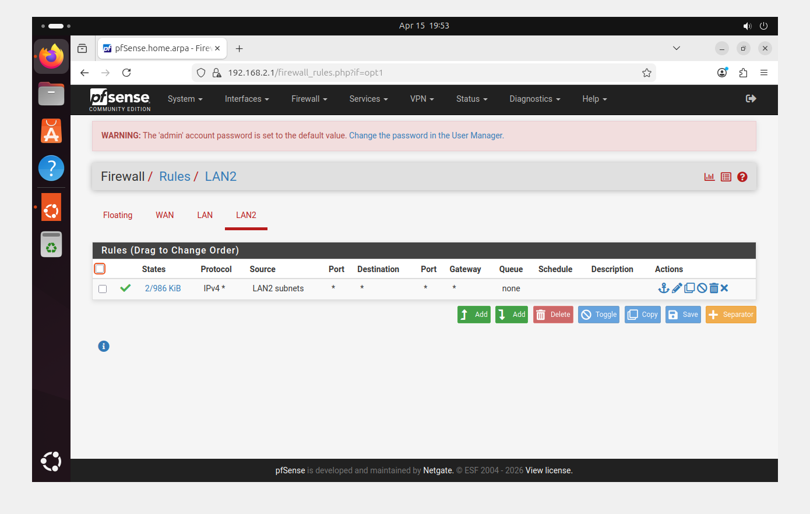
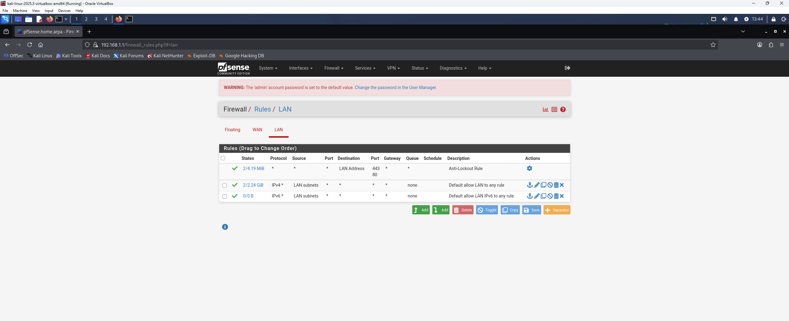

---

## 🔹 4. Connectivity Testing

---

## 🔹 5. Attack Simulation (Kali Linux)

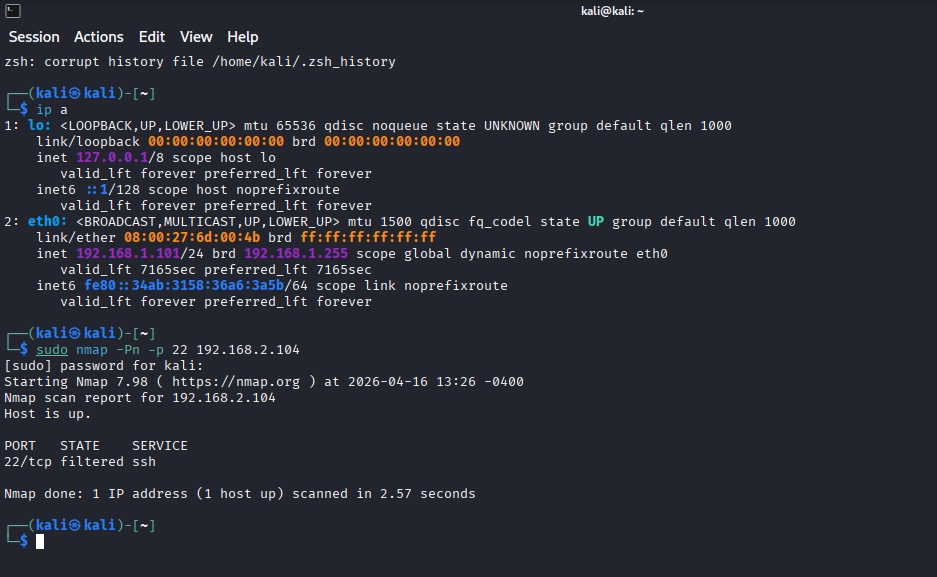
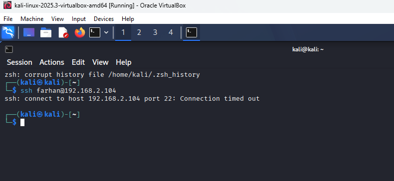

---

## 🔹 6. Zero Trust Enforcement (Blocked Access)

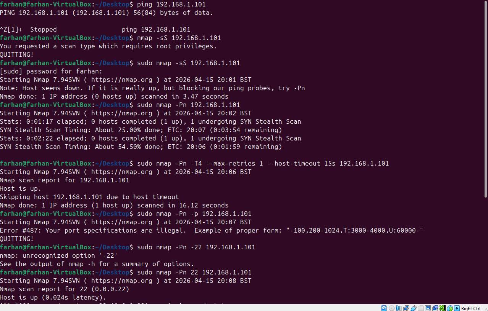
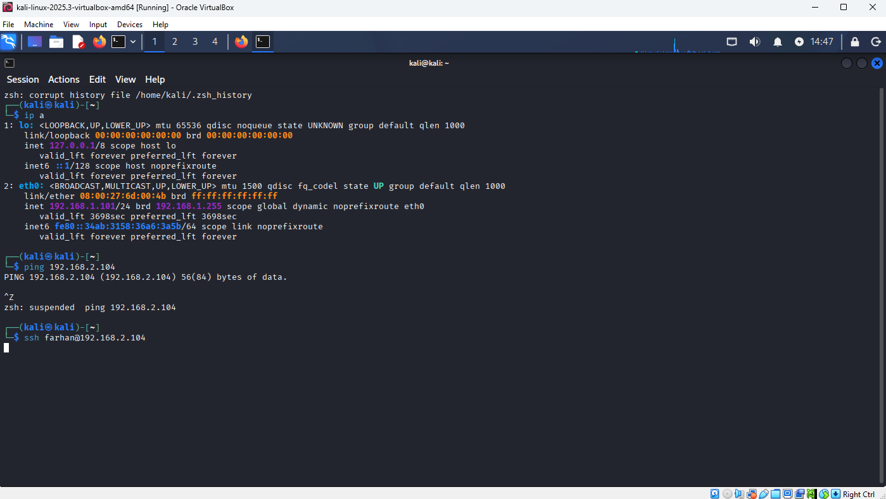

---

## 🔹 7. Successful Controlled Access

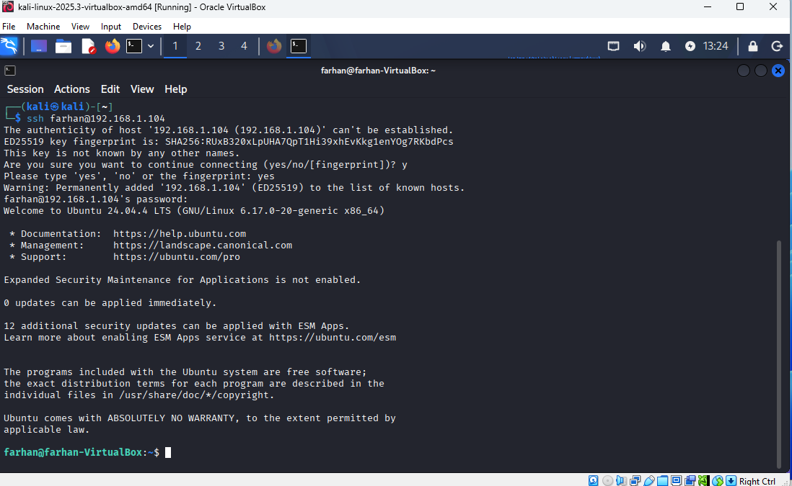

---

